<<<<<<< HEAD
<h1 align="center">
  <br/>
Mobile App </h1>

> This Project is based on [Obytes starter](https://starter.obytes.com)

## Requirements

- [React Native dev environment ](https://reactnative.dev/docs/environment-setup)
- [Node.js LTS release](https://nodejs.org/en/)
- [Git](https://git-scm.com/)
- [Watchman](https://facebook.github.io/watchman/docs/install#buildinstall), required only for macOS or Linux users
- [Pnpm](https://pnpm.io/installation)
- [VS Code Editor](https://code.visualstudio.com/download) ⚠️ Make sure to install all recommended extension from `.vscode/extensions.json`

## 👋 Quick start

Clone the repo to your machine and install deps :

```sh
git clone https://github.com/user/repo-name

cd ./repo-name

pnpm install
```

To run the app on ios

```sh
pnpm ios
```

To run the app on Android

```sh
pnpm android
```

## ✍️ Documentation

- [Rules and Conventions](https://starter.obytes.com/getting-started/rules-and-conventions/)
- [Project structure](https://starter.obytes.com/getting-started/project-structure)
- [Environment vars and config](https://starter.obytes.com/getting-started/environment-vars-config)
- [UI and Theming](https://starter.obytes.com/ui-and-theme/ui-theming)
- [Components](https://starter.obytes.com/ui-and-theme/components)
- [Forms](https://starter.obytes.com/ui-and-theme/Forms)
- [Data fetching](https://starter.obytes.com/guides/data-fetching)
- [Contribute to starter](https://starter.obytes.com/how-to-contribute/)
=======
# expo-react-native-paper

[](https://github.com/youzarsiph/expo-react-native-paper/actions/workflows/codeql.yml)
[](https://github.com/youzarsiph/expo-react-native-paper/actions/workflows/eslint.yml)
[](https://github.com/youzarsiph/expo-react-native-paper/actions/workflows/prettier.yml)

This repository is a template for React Native Expo applications. It integrates Expo Router and React Native Paper. It also demonstrates how to use Github Actions for linting and formatting.

## Features

- Expo
- Expo Router
- Material Design V3
- Cross Platform
- LTR and RTL support
- Multi lingual (`ar`, `en` and `tr`)

## Platforms

- Web
- IOS
- Android

## Screenshots

### Languages


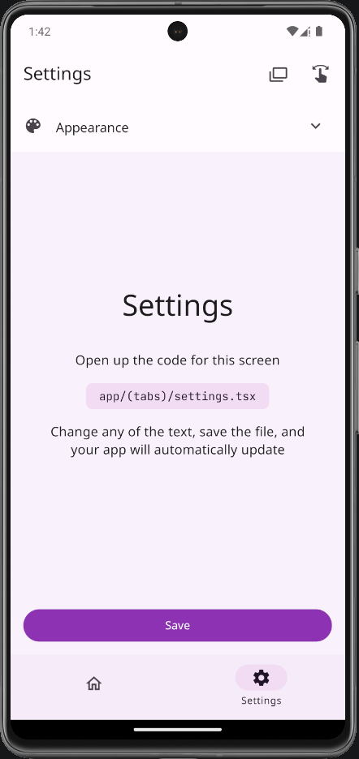
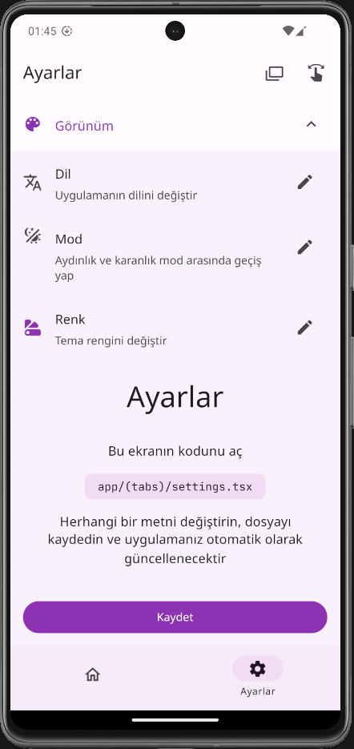

### Light Theme

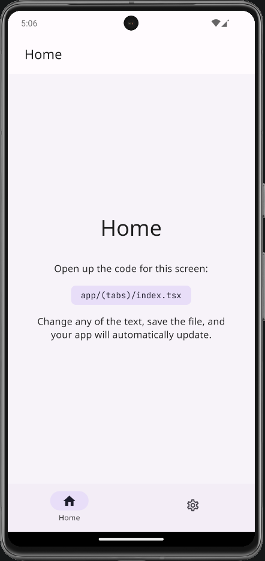
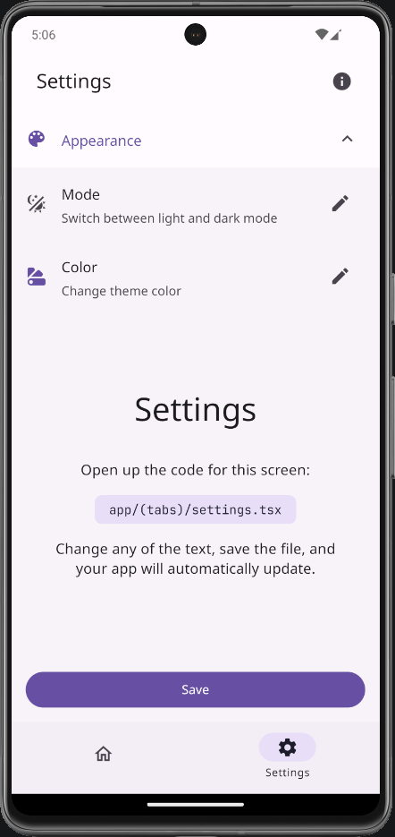
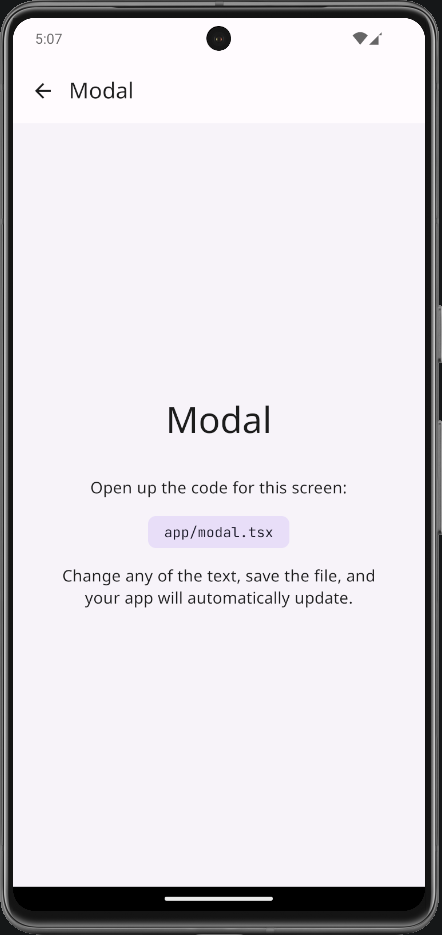

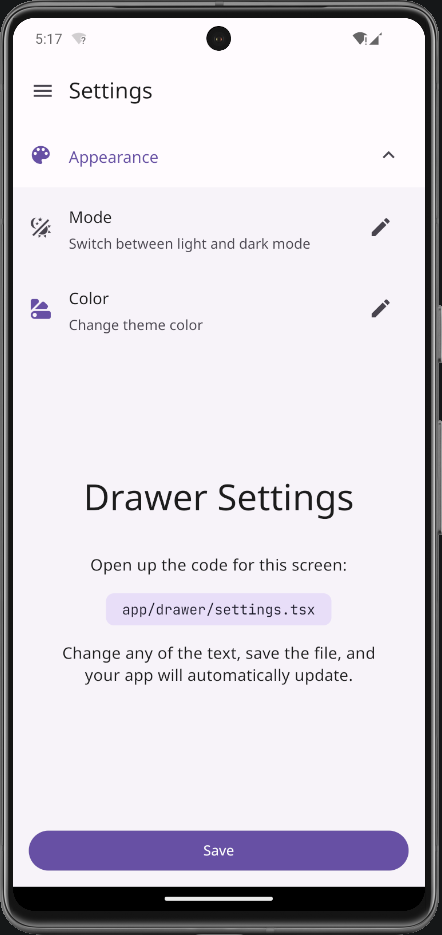
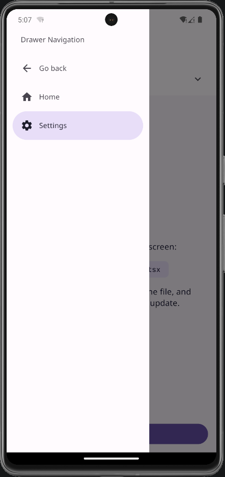

### Dark Theme

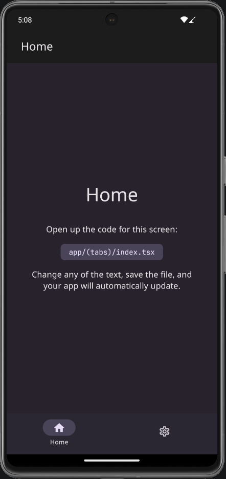
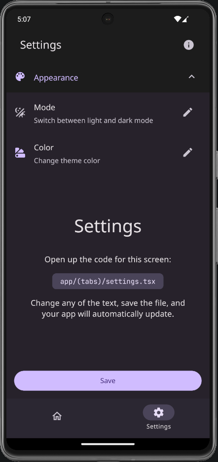
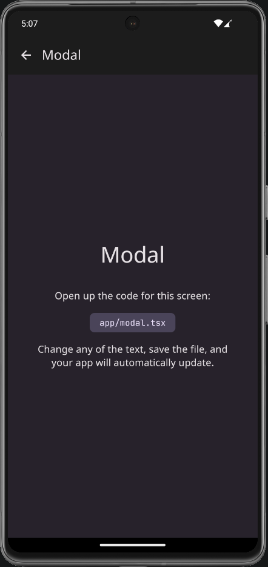
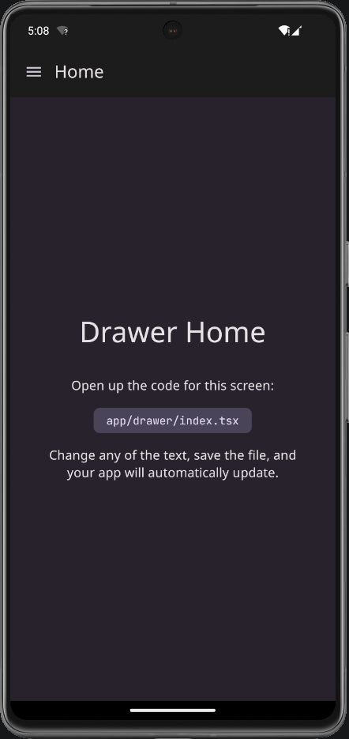
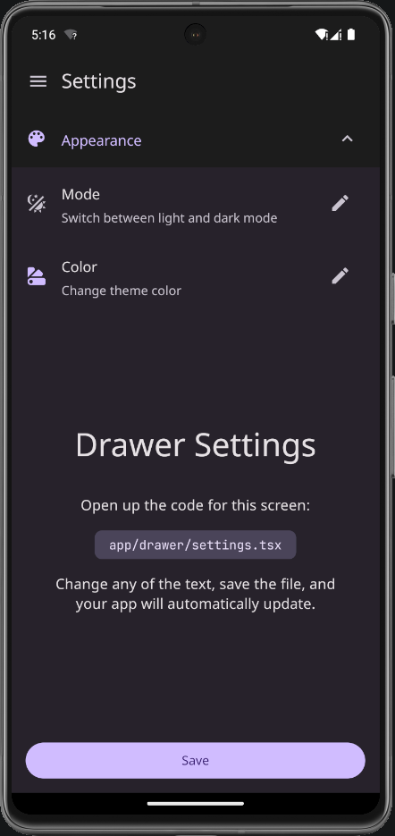
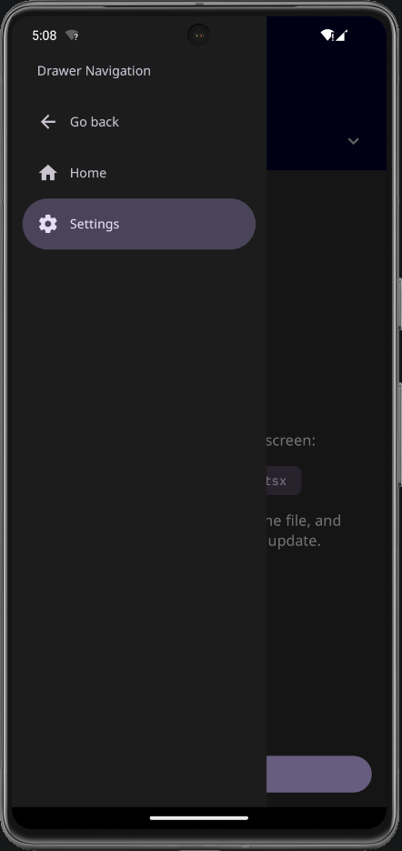

### Custom Themes


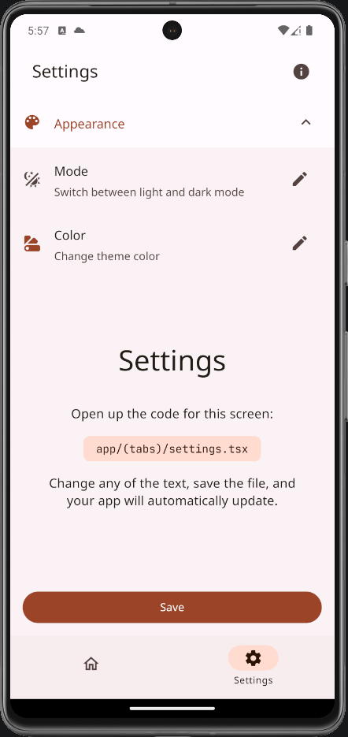
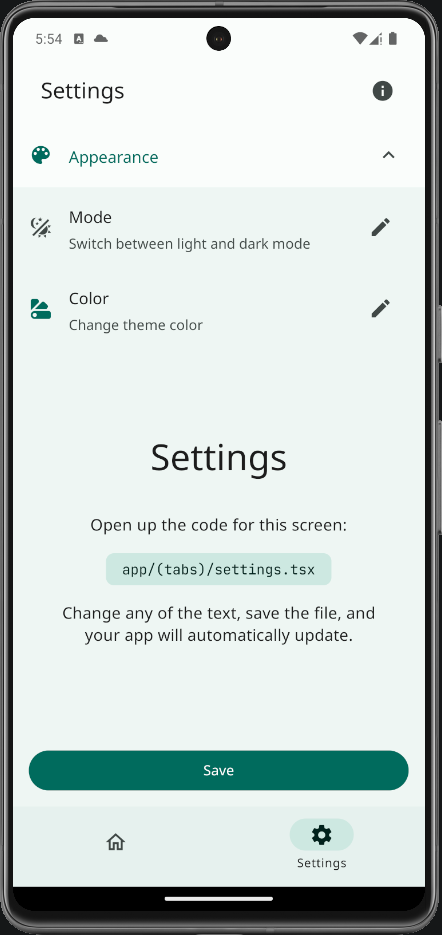

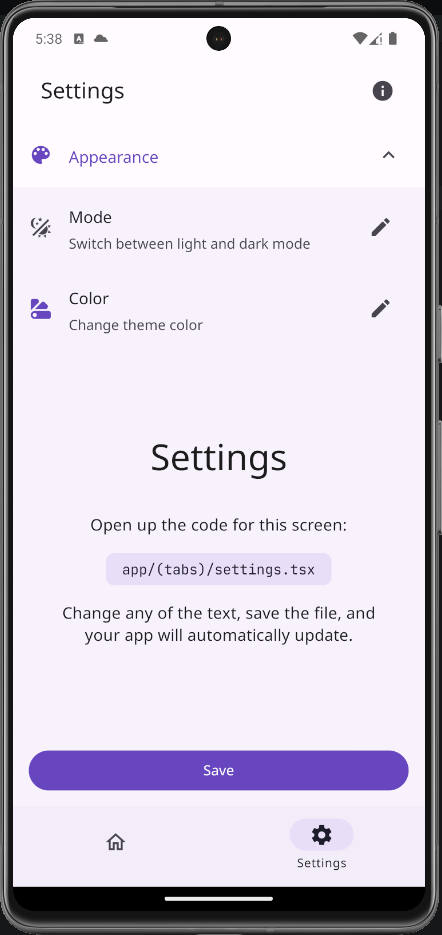
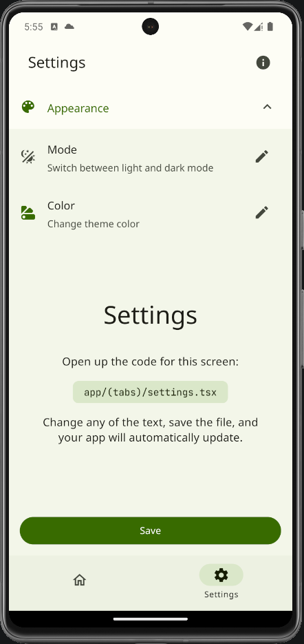
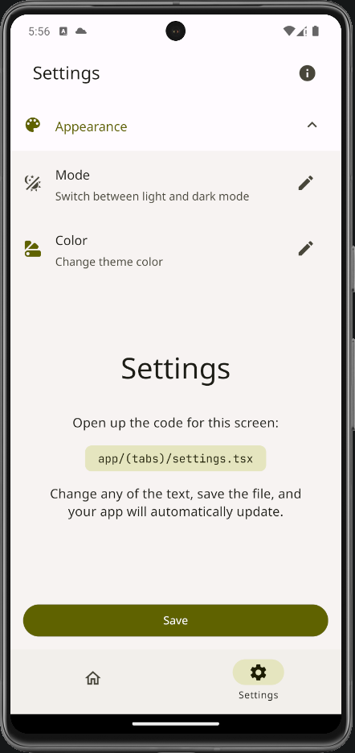
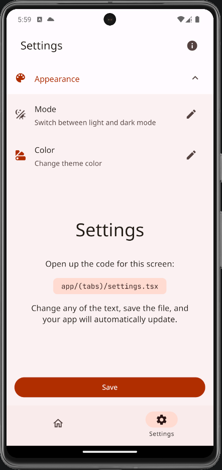
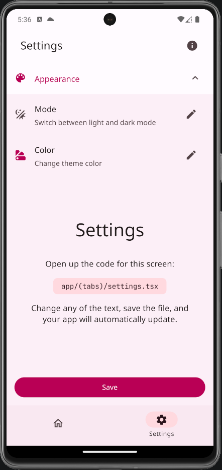
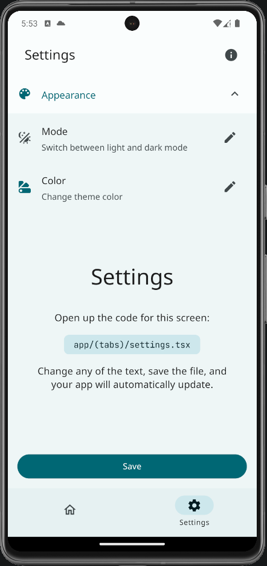
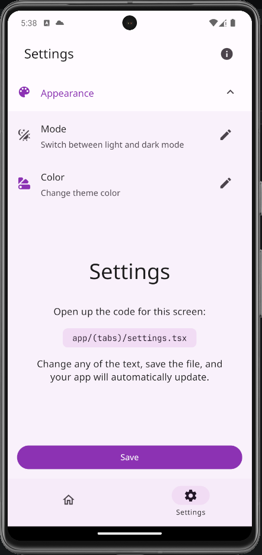

## Getting Started

These instructions will get you a copy of the project up and running on your local machine for development and testing purposes.

### Prerequisites

- Node.js
- npm

### Installation

1. Clone the repo
   ```sh
   git clone https://github.com/youzarsiph/expo-react-native-paper.git
   ```
2. Open `package.json` and update the `name` field to match your app's name
3. Install NPM packages
   ```sh
   npm install
   ```

## Built With

- TypeScript
- React
- React Native
- Expo
- Expo Router
- React Native Paper

## Contributing

Contributions are what make the open-source community such an amazing place to learn, inspire, and create. Any contributions you make are greatly appreciated.

1. Fork the Project
2. Create your Feature Branch (git checkout -b feature/AmazingFeature)
3. Commit your Changes (git commit -m 'Add some AmazingFeature')
4. Push to the Branch (git push origin feature/AmazingFeature)
5. Open a Pull Request

## License

Distributed under the MIT License. See LICENSE for more information.
>>>>>>> origin/develop
